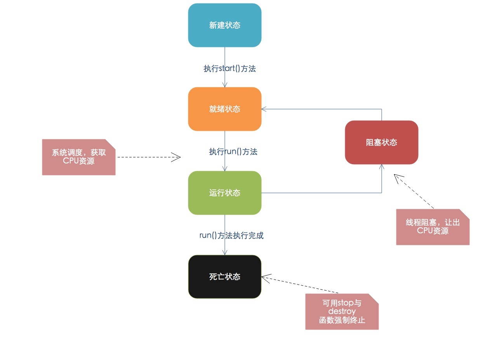

# java多线程

## 1. 线程和进程的概念
- 进程：进程是具有一定独立功能的程序关于某个数据集合上的一次运行活动,进程是系统进行资源分配和调度的一个独立单位。

- 线程：线程是进程的一个实体,是CPU调度和分派的基本单位,它是比进程更小的能独立运行的基本单位.线程自己基本上不拥有系统资源,只拥有一点在运行中必不可少的资源(如程序计数器,一组寄存器和栈),但是它可与同属一个进程的其他的线程共享进程所拥有的全部资源。

一个程序至少有一个进程,一个进程至少有一个线程

## 2. 几个概念
- 多线程：指的是这个程序（一个进程）运行时产生了不止一个线程。

- 并行与并发：
  - 并行：多个cpu实例或者多台机器同时执行一段处理逻辑，是真正的同时。
  - 并发：通过cpu调度算法，让用户看上去同时执行，实际上从cpu操作层面不是真正的同时。并发往往在场景中有公用的资源，那么针对这个公用的资源往往产生瓶颈，我们会用TPS或者QPS来反应这个系统的处理能力。
 
- 线程安全：经常用来描绘一段代码。指在并发的情况之下，该代码经过多线程使用，线程的调度顺序不影响任何结果。这个时候使用多线程，我们只需要关注系统的内存，cpu是不是够用即可。反过来，线程不安全就意味着线程的调度顺序会影响最终结果。

- 同步：Java中的同步指的是通过人为的控制和调度，保证共享资源的多线程访问成为线程安全，来保证结果的准确。

  一般代码简单加入@synchronized关键字。在保证结果准确的同时，提高性能，才是优秀的程序。线程安全的优先级高于性能。
  
## 3. 线程状态

- 新建状态:

使用 new 关键字和 Thread 类或其子类建立一个线程对象后，该线程对象就处于新建状态。它保持这个状态直到程序 start() 这个线程。

- 就绪状态:

当线程对象调用了start()方法之后，该线程就进入就绪状态。就绪状态的线程处于就绪队列中，要等待JVM里线程调度器的调度。

- 运行状态:

如果就绪状态的线程获取 CPU 资源，就可以执行 run()，此时线程便处于运行状态。处于运行状态的线程最为复杂，它可以变为阻塞状态、就绪状态和死亡状态。

- 阻塞状态:

如果一个线程执行了sleep（睡眠）、suspend（挂起）等方法，失去所占用资源之后，该线程就从运行状态进入阻塞状态。在睡眠时间已到或获得设备资源后可以重新进入就绪状态。可以分为三种：

-等待阻塞：

运行状态中的线程执行 wait() 方法，使线程进入到等待阻塞状态。

- 同步阻塞：

线程在获取 synchronized 同步锁失败(因为同步锁被其他线程占用)。

- 其他阻塞：

通过调用线程的 sleep() 或 join() 发出了 I/O 请求时，线程就会进入到阻塞状态。当sleep() 状态超时，join() 等待线程终止或超时，或者 I/O 处理完毕，线程重新转入就绪状态。

- 死亡状态:

一个运行状态的线程完成任务或者其他终止条件发生时，该线程就切换到终止状态。
  
--- 
  
  未完，待续
